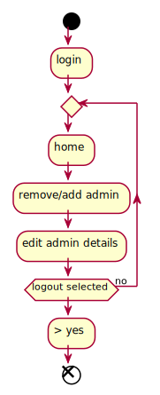
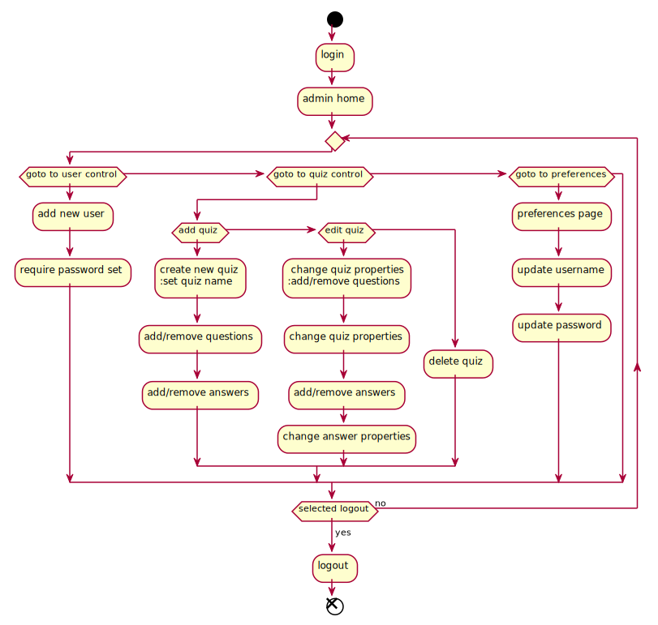
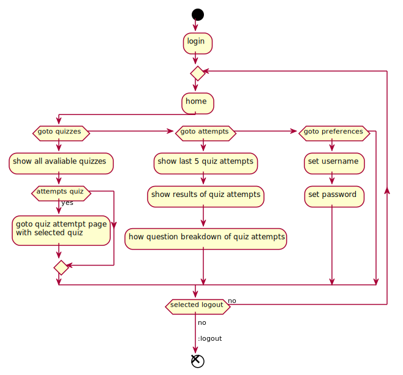

# Planning files

[home](../index.md)

This folder contains all the files created when planning this project.

these files were created using plantuml as it allows quick development of specific diagrams.

## Files

- [root activity](./root-activity.plantuml)
- [admin activity](./admin-activity.plantuml)
- [user activity](./user-activity.plantuml)

## images

### root activity

### admin activity

### user activity

